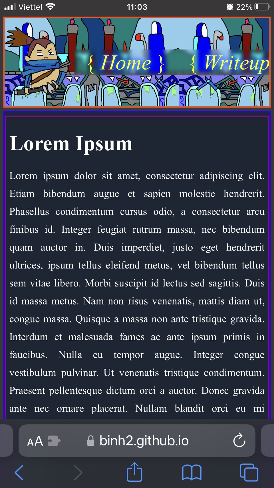

# Best yasuo - Blog template

## Table of contents

- [Overview](#overview)
  - [Desktop demo](#desktop-demo)
  - [Mobile screenshot](#mobile-screenshot)
  - [Links](#links)
- [My process](#my-process)
  - [Built with](#built-with)
  - [What I learned](#what-i-learned)
  - [Continued development](#continued-development)
  - [Useful resources](#useful-resources)
- [Run my source code locally](#run-my-source-code-locally)
- [Author](#author)
- [My recent works](#my-recent-works)
- [Acknowledgments](#acknowledgments)

## Overview

### Desktop demo

https://user-images.githubusercontent.com/53990204/214478587-209b3ab0-7458-4725-80c5-3abebee691e6.mp4

### Mobile screenshot



### Links

- My source code URL: [My github brother-blog repo](https://github.com/Binh2/brother-blog/)
- Live Site URL: [Visit my live site](https://binh2.github.io/brother-blog/)

## My process

### Built with

- HTML elements
- CSS custom properties
- CSS Flexbox
- CSS Grid
- Responsive web design
- Vanilla Javascript
- VueJS
- Vue Router
- highlight.js, vue-highlight.js to high light code

### What I learned

#### HTML

```html
<form>
  <!-- prevent page from reloading after button clicked -->
  <button type="button">Some text</button> 
</form>
```

#### Javascript

```js
// VueJS
// Dynamically move component based on scroll
import { ref } from "vue";

export default {
  setup() {
    const marginTop = ref(0);

    function handleScroll() {
      marginTop.value = window.scrollY;
    }

    return {
      marginTop,
      handleScroll,
    };
  },
  mounted() {
    window.addEventListener("scroll", this.handleScroll);
  },
  onUnmounted() {
    window.removeEventListener("scroll", this.handleScroll);
  },
};
```

### Continued development

This is some of the improvement that could work:

- Make component style more independent.
- Make NavItemsView font-size smaller or wrap text on mobile portrait mode so text doesn't get hidden.
- Use JS to generate animation instead of CSS animation to make CSS timing more perfectly.

### Useful resources

- [VueJS](https://vuejs.org/) - This helped me learn VueJS.
- [Vue Router](https://router.vuejs.org/) - This helped me learn Vue Router.
- [Vue CLI deploy to Github](https://cli.vuejs.org/guide/deployment.html#github-pages) - This article help me deploy my project to Github Pages, although, it's outdated and doesn't work. [Checkout how I fix it](https://github.com/Binh2/multi-step-form#bash)

## Run my source code locally

### Clone my project to your local machine
```
git clone https://github.com/Binh2/brother-blog.git
```

### Project setup (Install JS dependencies)
```
npm install
```

### Lints and fixes files
```
npm run lint
```

### Compiles and hot-reloads for development
```
npm run serve
```

## How to deploy to my Github Pages (btw, you can't do this without my permission unless you fork my project).

### Compiles and minifies for production (Call npm run deploy will run this command automatically so you don't need to run this command).
```
npm run build
```

### Deploy to my Github Page (If you decided to fork your own project from mine then you might have to reconfigure /deploy.sh and /vue.config.js. Check out [Vue CLI deploy to Github](https://cli.vuejs.org/guide/deployment.html#github-pages))
```
npm run deploy
```

## Need more info on customizing Vue CLI configuration
See [Configuration Reference](https://cli.vuejs.org/config/).

## Author

- Frontend Mentor - [@Binh2](https://www.frontendmentor.io/profile/Binh2)
- Twitter - [@hgqbinh2002](https://twitter.com/hgqbinh2002)
- LinkedIn - [hgqbinh2002](https://www.linkedin.com/in/hgqbinh2002/)

## My recent works

### Multi-step form

- Solution URL: [My github multi-step-form repo](https://github.com/Binh2/multi-step-form/)
- Live Site URL: [Visit my live site](https://binh2.github.io/multi-step-form/)

### News homepage

- Solution URL: [Check out my solution](https://github.com/Binh2/news-homepage)
- Live Site URL: [My live webpage](https://binh2.github.io/news-homepage/)

## Acknowledgments

- Big thanks to my brother to give me the idea to do this project.
